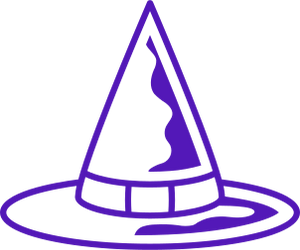
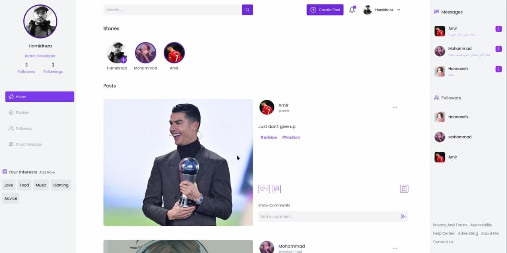

<div id="top"></div>
<!--
*** Thanks for checking out the Best-README-Template. If you have a suggestion
*** that would make this better, please fork the repo and create a pull request
*** or simply open an issue with the tag "enhancement".
*** Don't forget to give the project a star!
*** Thanks again! Now go create something AMAZING! :D
-->

<!-- PROJECT SHIELDS -->
<!--
*** I'm using markdown "reference style" links for readability.
*** Reference links are enclosed in brackets [ ] instead of parentheses ( ).
*** See the bottom of this document for the declaration of the reference variables
*** for contributors-url, forks-url, etc. This is an optional, concise syntax you may use.
*** https://www.markdownguide.org/basic-syntax/#reference-style-links
-->

[![Contributors][contributors-shield]][contributors-url]
[![Forks][forks-shield]][forks-url]
[![Stargazers][stars-shield]][stars-url]
[![Issues][issues-shield]][issues-url]
[![MIT License][license-shield]][license-url]
[![LinkedIn][linkedin-shield]][linkedin-url]

<!-- PROJECT LOGO -->
<br />
<div align="center">
  <a href="https://github.com/hamidrezaramzani/social-media">
    
  </a>

<h3 align="center">Nitrum</h3>

  <p align="center">
    A social network for building new connections
    <br />   
    ·
    <a href="https://github.com/hamidrezaramzani/social-media/issues">Report Bug</a>
    ·
    <a href="https://github.com/hamidrezaramzani/social-media/issues">Request Feature</a>
  </p>
</div>

<!-- TABLE OF CONTENTS -->
<details>
  <summary>Table of Contents</summary>
  <ol>
    <li>
      <a href="#about-the-project">About The Project</a>
      <ul>
        <li><a href="#built-with">Built With</a></li>
      </ul>
    </li>
    <li>
      <a href="#getting-started">Getting Started</a>
      <ul>
        <li><a href="#prerequisites">Prerequisites</a></li>
        <li><a href="#installation">Installation</a></li>
      </ul>
    </li>
    <li><a href="#usage">Usage</a></li>
    <li><a href="#roadmap">Roadmap</a></li>
    <li><a href="#contributing">Contributing</a></li>
    <li><a href="#license">License</a></li>
    <li><a href="#contact">Contact</a></li>
    <li><a href="#acknowledgments">Acknowledgments</a></li>
  </ol>
</details>

<!-- ABOUT THE PROJECT -->

## About The Project



Nitrum is a small social network I chose to challenge my skills. In this social network, you have the ability to `post` and `story`, as well as `follow other people` and `chat` with them.

<p align="right">(<a href="#top">back to top</a>)</p>

### Built With

- [React.js](https://reactjs.org/)
  - [Tailwindcss](https://tailwindcss.com/)
  - [React router 6](https://reactrouter.com/)
  - [Context API](https://reactjs.org/docs/context.html)
  - [Axios](https://github.com/axios/axios)
  - [React hook form](https://react-hook-form.com/)
  - [Yup](https://github.com/jquense/yup)
  - [SocketIO Client](https://socket.io/docs/v4/client-api/)
- [Node Js](https://nodejs.org/en/)
  - [Express](https://expressjs.com/)
  - [Mongodb](https://expressjs.com/)
  - [Socket IO](https://socket.io/docs/v4/)

<p align="right">(<a href="#top">back to top</a>)</p>

<!-- GETTING STARTED -->

## Getting Started

This is an example of how you may give instructions on setting up your project locally.
To get a local copy up and running follow these simple example steps.

### Prerequisites

This is an example of how to list things you need to use the software and how to install them.

- npm
  ```sh
  npm install npm@latest -g
  ```

### Installation

1. Clone the repo
   ```sh
   git clone https://github.com/hamidrezaramzani/social-media.git
   ```
2. Install NPM packages , (client and server)
   ```sh
   npm install
   ```

<p align="right">(<a href="#top">back to top</a>)</p>

<!-- USAGE EXAMPLES -->

## Contact

Hamidreza Ramzani -  iamhamidreza.ir

Project Link: [https://github.com/hamidrezaramzani/social-media](https://github.com/hamidrezaramzani/social-media)

<p align="right">(<a href="#top">back to top</a>)</p>

<!-- MARKDOWN LINKS & IMAGES -->
<!-- https://www.markdownguide.org/basic-syntax/#reference-style-links -->

[contributors-shield]: https://img.shields.io/github/contributors/hamidrezaramzani/social-media.svg?style=for-the-badge
[contributors-url]: https://github.com/hamidrezaramzani/social-media/graphs/contributors
[forks-shield]: https://img.shields.io/github/forks/hamidrezaramzani/social-media.svg?style=for-the-badge
[forks-url]: https://github.com/hamidrezaramzani/social-media/network/members
[stars-shield]: https://img.shields.io/github/stars/hamidrezaramzani/social-media.svg?style=for-the-badge
[stars-url]: https://github.com/hamidrezaramzani/social-media/stargazers
[issues-shield]: https://img.shields.io/github/issues/hamidrezaramzani/social-media.svg?style=for-the-badge
[issues-url]: https://github.com/hamidrezaramzani/social-media/issues
[license-shield]: https://img.shields.io/github/license/hamidrezaramzani/social-media.svg?style=for-the-badge
[license-url]: https://github.com/hamidrezaramzani/social-media/blob/master/LICENSE.txt
[linkedin-shield]: https://img.shields.io/badge/-LinkedIn-black.svg?style=for-the-badge&logo=linkedin&colorB=555
[linkedin-url]: https://linkedin.com/in/hamidrezaramzani
[product-screenshot]: screenshot.jpg
